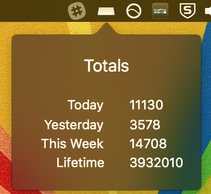

## Keylixer

This thing counts your keystrokes.

### Detail

It listens to read-only keydown events through officially supported Cocoa APIs
and then counts and stores the totals so you can pull the data back out for
stats later.

### Screenshot

